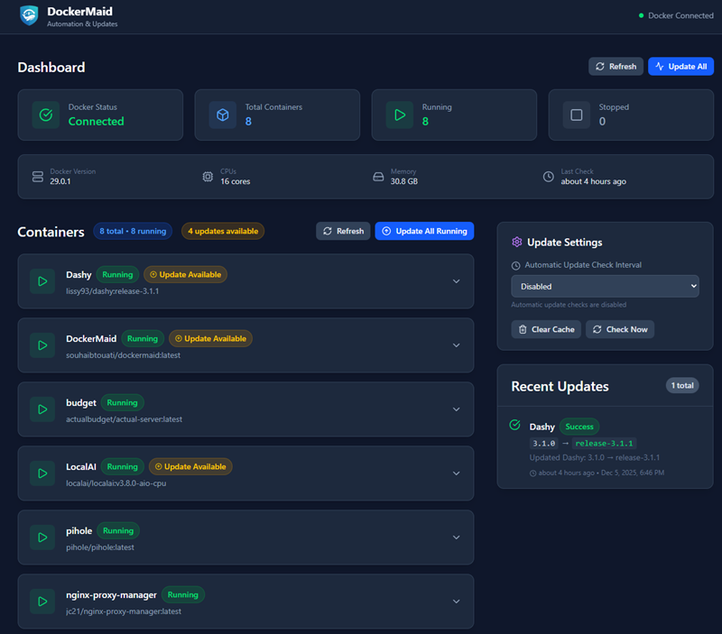
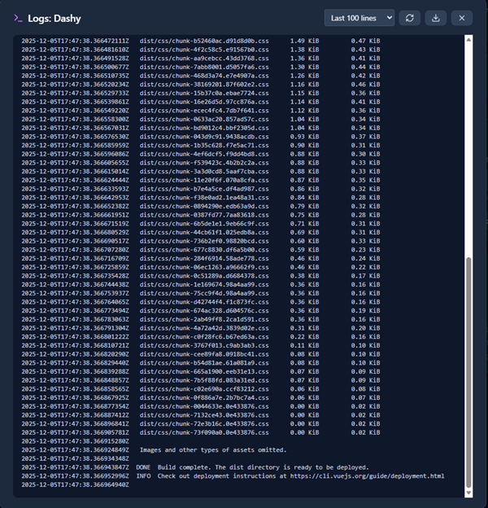
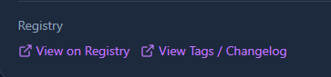

# DockerMaid 🐳

A modern Docker container management dashboard with real-time monitoring, automatic update detection, and seamless container updates.


[](https://hub.docker.com/r/souhaibtouati/dockermaid)


## Features

- **Real-time Container Monitoring**: View all Docker containers with live status updates
- **Update Detection**: Automatically checks Docker Hub for newer image versions and shows update badges
- **Tag Selection**: Choose which tag to update to (latest, stable, beta, etc.)
- **Container Controls**: Start, stop, restart containers directly from the dashboard
- **Pull & Recreate**: Update containers by pulling the latest image and recreating them
- **Pull Image Only**: Download the latest image without recreating the container
- **Container Logs**: View real-time container logs with auto-scroll, download, and stderr highlighting
- **Registry Links**: Quick links to Docker Hub (or other registries) to view changelogs before updating
- **Docker System Info**: View Docker version, CPU, memory, and container statistics
- **Update Logs**: Track all container update operations with version history
- **Periodic Check Settings**: Configure automatic update check intervals
- **Self-Update Detection**: Detects when DockerMaid itself needs an update
- **Modern UI**: Clean, responsive interface built with React and TailwindCSS

## Quick Start with Docker

```bash
docker run -d \
  --name dockermaid \
  -p 3000:3000 \
  -v /var/run/docker.sock:/var/run/docker.sock:ro \
  souhaibtouati/dockermaid:latest
```

Then open http://localhost:3000

## Docker Compose

```yaml
services:
  dockermaid:
    image: souhaibtouati/dockermaid:latest
    container_name: dockermaid
    restart: unless-stopped
    ports:
      - "3000:3000"
    volumes:
      - /var/run/docker.sock:/var/run/docker.sock:ro
    environment:
      - API_TOKEN=your-secret-token  # Optional: secure the API
```

## Environment Variables

| Variable | Default | Description |
|----------|---------|-------------|
| `PORT` | `3000` | Server port |
| `API_TOKEN` | *(none)* | Optional API authentication token |
| `CHECK_INTERVAL` | `3600000` | Update check interval in milliseconds (default: 1 hour) |
| `AUTO_UPDATE` | `false` | Enable automatic container updates |

## Development

### Prerequisites

- Node.js 18+
- Docker (for the backend to manage containers)
- npm or yarn

### Installation

```bash
# Install frontend dependencies
npm install

# Install server dependencies
cd server && npm install && cd ..

# Start both frontend and backend in development mode
npm run dev:all
```

Or run them separately:

```bash
# Terminal 1: Start the backend server
npm run dev:server

# Terminal 2: Start the frontend dev server
npm run dev
```

The frontend runs on http://localhost:5173 and proxies API requests to the backend on port 3001.

### Building for Production

```bash
npm run build
```

## API Endpoints

### Health Check
- `GET /api/health` - Check Docker connection status

### Containers
- `GET /api/containers` - List all containers with update status
- `GET /api/containers/:id` - Get container details
- `POST /api/containers/:id/start` - Start a container
- `POST /api/containers/:id/stop` - Stop a container
- `POST /api/containers/:id/restart` - Restart a container
- `GET /api/containers/:id/logs` - Get container logs (query: `tail` for line count)
- `POST /api/containers/:id/update` - Pull latest image and recreate container
- `POST /api/containers/update-all` - Update all containers with available updates (skips self-update)

### Images
- `GET /api/images` - List Docker images
- `POST /api/images/:imageName/pull` - Pull latest version of an image
- `GET /api/images/:imageName/registry-url` - Get registry URLs for an image

### System
- `GET /api/supervisor/status` - Get DockerMaid status
- `GET /api/docker/info` - Get Docker system information

### Settings
- `GET /api/settings` - Get current settings
- `PUT /api/settings` - Update settings (checkInterval, autoUpdate)

### Logs
- `GET /api/logs` - Get update logs
- `DELETE /api/logs` - Clear logs

### Cache
- `POST /api/cache/clear` - Clear update detection cache

## Tech Stack

### Frontend
- React 18 + TypeScript
- Vite (rolldown-vite)
- TailwindCSS
- Lucide React icons
- Axios

### Backend
- Node.js + Express
- Dockerode (Docker API client)

## Security Notes

⚠️ **Docker Socket Access**: DockerMaid requires access to the Docker socket to manage containers. This gives it significant control over your Docker environment.

Recommendations:
- Use the `API_TOKEN` environment variable to secure the API
- Consider running behind a reverse proxy with authentication
- Only expose to trusted networks
- Use read-only socket mount when possible: `-v /var/run/docker.sock:/var/run/docker.sock:ro`

## Screenshots

### Container List with Update Detection
The dashboard shows all containers with their status. When an update is available, a badge appears next to the container name.


### Container Logs
View real-time logs from any container with syntax highlighting for stderr messages.



### Registry Links
Quick access to Docker Hub or other registries to view available tags and changelogs before updating.



## Changelog

### v1.4.0
- ✨ **Smart Update All**: "Update All" button now only updates containers with available updates
- ✨ **Automatic Latest Tag**: Pinned version containers are updated to `latest` tag automatically
- ✨ **Rollback Detection**: Cache invalidates when local image changes (detects rollbacks)
- ✨ **Self-Update Protection**: Batch updates skip DockerMaid to prevent crashes (with manual instructions)
- ✨ **Update History Tags**: Shows version/tag names in update logs instead of SHA hashes
- 🔧 **GitHub CI/CD**: Added workflows for CI and Docker Hub publishing
- 📝 **Contributor Docs**: Added CONTRIBUTING.md, PR/issue templates, and code of conduct

### v1.3.0
- 🎨 **New Branding**: Renamed to DockerMaid with new shield logo
- ✨ **Tag Selection**: Choose which tag to update to (latest, stable, beta, etc.)
- ✨ **Self-Update Detection**: Detects when DockerMaid container needs updating
- 🐛 **Fixed Pinned Version Detection**: Properly detects updates for containers with pinned version tags
- 🐛 **Fixed Container Recreation**: Preserves all container settings (Cmd, Entrypoint, WorkingDir, etc.)

### v1.2.0
- ✨ **Update Detection**: Automatically detects when newer images are available on Docker Hub
- ✨ **Container Logs**: View container logs in a modal with auto-scroll, refresh, and download
- ✨ **Pull Image Only**: New button to pull latest image without recreating container
- ✨ **Registry Links**: Links to Docker Hub to view tags/changelogs before updating
- 🐛 Improved error handling and logging for update detection

### v1.1.0
- ✨ Added periodic update check settings
- ✨ Added version display in footer
- 🐛 Fixed authentication for same-origin requests

### v1.0.0
- 🎉 Initial release
- Container monitoring and controls
- Pull & recreate functionality
- Update logs

## License

MIT
